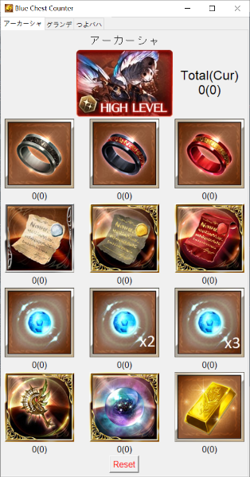

## Discription/介绍/紹介
Small application to help record the drops while gold-hunting in GBF: Akasha, Grand Order, Proto Bahamut.
帮助记录GBF猎金掉落的小程序。支持阿卡夏、大公、大巴。
グラブルの青箱ドロップ記録のアプリ。アーカーシャ、グランデ、つよばは。

## How to use/使用说明/使用說明
Left click on the item icon to increase counting, right click to decrease.
Format of 'Total(Current)'' to represent total drops and current streak, respectively
Click the 'Reset' button if you want to restart the current counting. (eg. maybe when you dropped a gold)
左键增加，右键减少。累积(当前)的格式来记录各个物品的掉落情况。点击'Reset'按钮来重置当前记录（没准你想出金后重新记录）
左ボタンで増え、右ボタンで減らす。全部(現在)のフォーマットで各ドロップを記録します。'Reset'ボッチに現在の記録をリセットします（例えヒヒドロップしました）

## Screenshots/截图/スクリーンショット

## Installation/安装/インストール
[GitHub release](https://github.com/villestring/GBF-Blue-chest-counter/releases)
